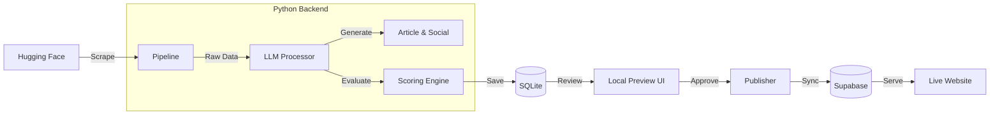

# TopTierModels: automated AI Tier List & Content Engine

> [!INFO] **Quick Pitch**
> **TopTierModels** is an automated pipeline that discovers AI models from Hugging Face, evaluates them using LLMs, and publishes comprehensive reviews and tier lists to a web platform. It solves the problem of keeping up with the daily flood of new AI models by automating the analysis, scoring, and content generation process.

---

## 🏗️ Tech Stack

> [!ABSTRACT] **At a Glance**
> A **Full-Stack** application combining a **Python/FastAPI** backend for heavy lifting (AI processing, scraping) with a **React** frontend for presentation.

### Backend (The Intelligence)
*   **Language**: `Python 3.x`
*   **API Framework**: `FastAPI` (Async, Pydantic validation)
*   **Scraping**: `BeautifulSoup/requests` (Hugging Face data extraction)
*   **AI/LLM**: Integrations with `OpenAI`, `Anthropic`, and `Ollama` for content generation and logic.
*   **Data Processing**: Custom `Scoring Engine` and `Category Classifier`.

### Frontend (The Visuals)
*   **Framework**: `React 18`
*   **Build Tool**: `Vite` (Fast HMR)
*   **Styling**: Vanilla CSS / Custom Variables (Theming with `--tier-x` variables)
*   **State**: React Hooks

### Database & Infra
*   **Local**: `SQLite` (For preserving preview sessions locally before logic)
*   **Production**: `Supabase` (PostgreSQL + Storage for images)
*   **Deployment**: `Netlify` (Frontend), likely self-hosted/local for the backend pipeline.

---

## 🧩 System Architecture

> [!TIP] **Architecture Highlight**
> The system uses a **Hybrid Database Strategy**. We use **SQLite** locally to allow for rapid iteration and "drafts" without polluting the production database. Only "Published" content is synced to **Supabase**.

---

## ⚡ Key Workflows

### 1. From URL to Content
The user feeds a Hugging Face URL. The system:
1.  **Scrapes** metadata (downloads, likes, tags).
2.  **Classifies** the model (Vision, NLP, Audio).
3.  **Generates** a 1500-word technical article using an LLM.
4.  **Scores** the model (S, A, B, C, D) based on weighted criteria (Performance, Usability, etc.).
5.  **Creates** a LinkedIn post hook.

### 2. The Verification Loop
Before going live, everything is viewable in a **Local Preview Environment**.
*   Verify the calculated "Tier".
*   Read the generated article.
*   *Correction/Override*: If the LLM halluconated a feature, it can be fixed here.

---

## 💬 Interview Talking Points

If asked about...

**"How do you handle LLM reliability?"**
> We implement a human-in-the-loop verification step. The LLM does the heavy lifting (drafting, initial scoring), but nothing goes to Supabase without passing through the Local Preview interface.

**"Why two databases?"**
> To separate "Draft" state from "Production" state. SQLite is perfect for the single-user local processing pipeline. Supabase offers the scalability and features (Row Level Security, Realtime) needed for the public-facing React app.

**"How is the Tier calculated?"**
> It's not arbitrary. We use a weighted algorithm in `scoring_engine.py` that balances hard metrics (Downloads, Likes) with qualitative assessment (Documentation quality, Innovation) extracted by the LLM.

---

## 📚 Documentation Links
- [[how-it-works]] - Detailed detailed architectural breakdown.
- [[supabase-setup]] - Schema and connection details.
- [[PRS]] - Product Requirement Specifications.
